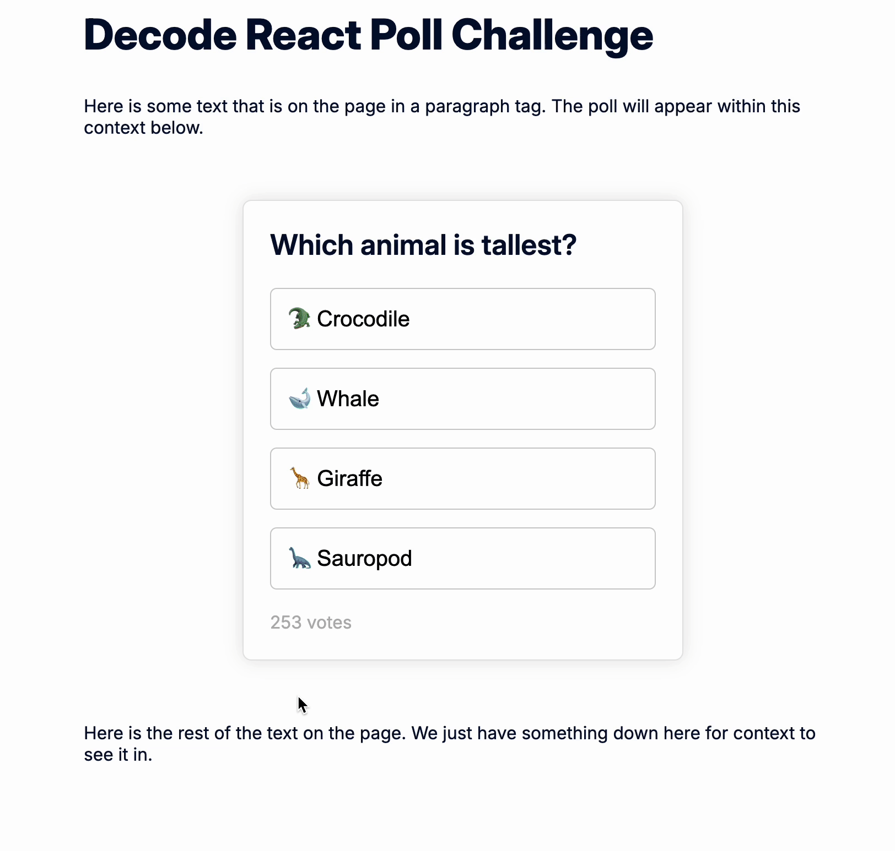
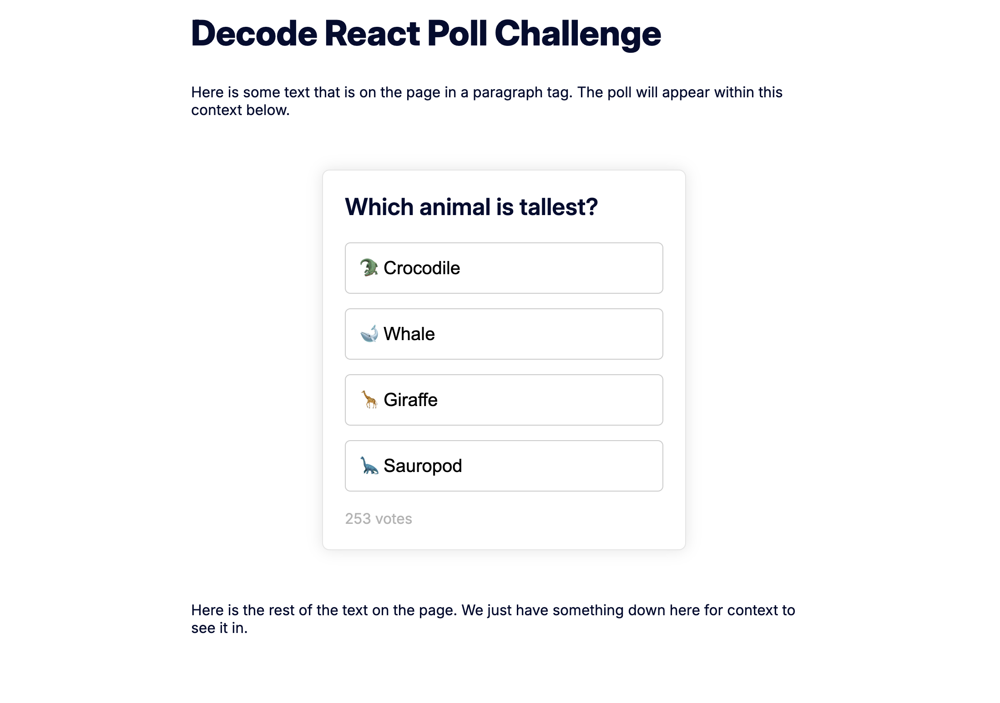
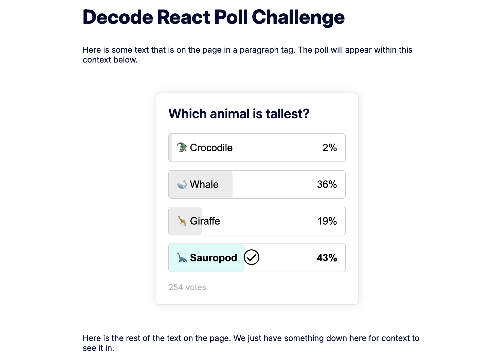
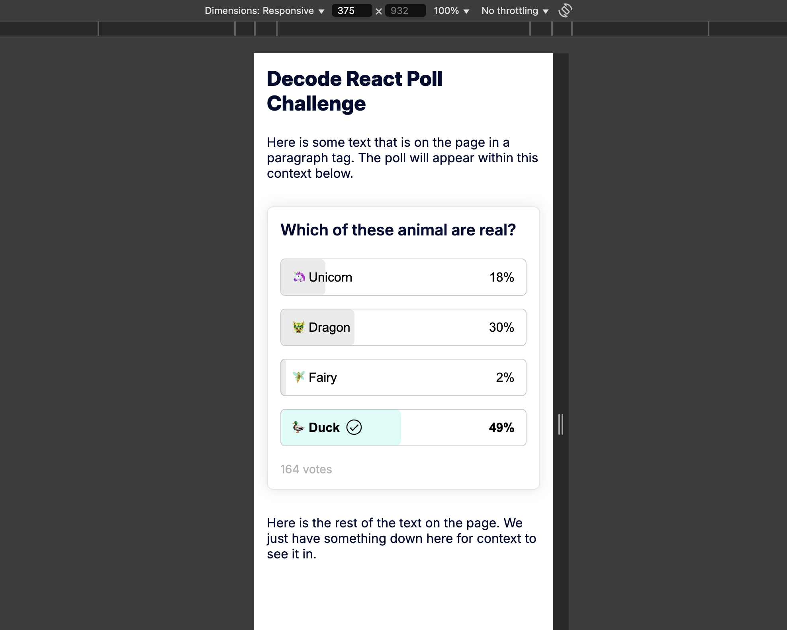

# 🗳️ Decode React Poll Challenge

Built with **React + TypeScript + styled-components + react-pose**, this poll component mimics interactive embedded polls you might find in blog posts.

---

## 🔍 Features

- ✅ Fully functional poll UI with vote tracking
- ✅ Uses **React functional components** and **hooks**
- ✅ **TypeScript** throughout with strict typing
- ✅ Styled via **styled-components** (following repo conventions)
- ✅ Animations via **react-pose**
- ✅ Mobile responsive for 480px and up
- ✅ Accessible structure (semantic markup + focus states)

---

## 💎 Extra Features

| Feature                   | Description                                                               |
| ------------------------- | ------------------------------------------------------------------------- |
| ✨ Animated entrance      | Poll options appear in a cascade effect on page load                      |
| 📈 Count-up effect        | Vote percentages animate smoothly                                         |
| 📱 Mobile responsiveness  | Fully optimized down to small mobile screens                              |
| 🧠 Memoized rendering     | `PollOption` is memoized to prevent unnecessary re-renders                |
| 🎯 Clean state management | Voting logic handled via `useCallback`, state updates, and derived values |

---

## 🌀 Demo



## 📸 Screenshots

### ▶️ Initial state



### ✅ After voting



### 📱 Mobile view

<p align="center">
  
</p>

---

## 🚀 Getting Started

```bash
yarn install
yarn dev
```
